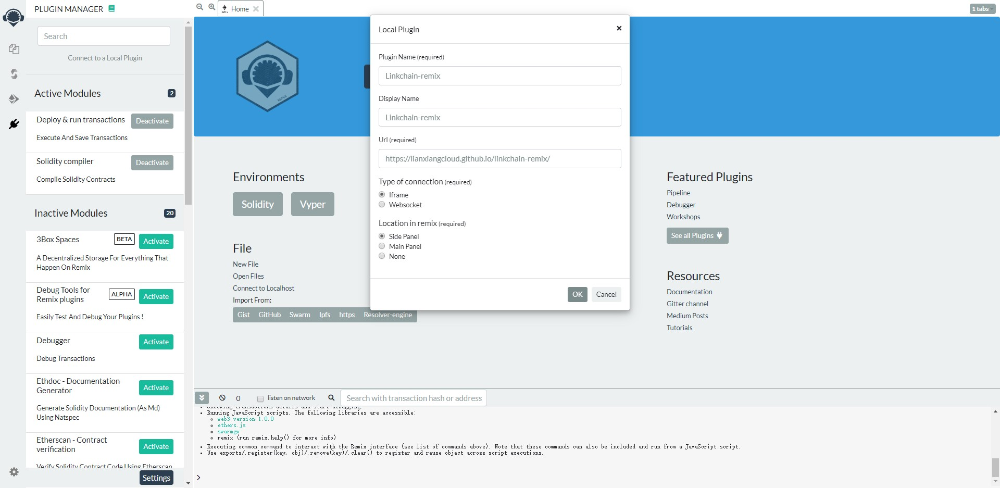
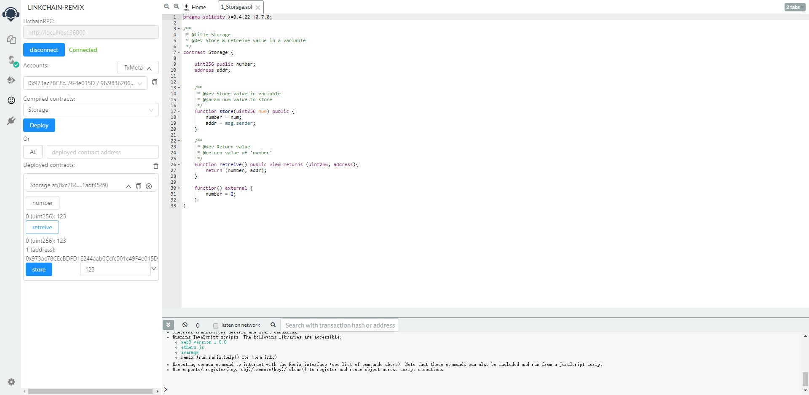

## Linkchain-remix

remix插件，可以通过此插件实现在remix上连接linkchain节点并部署和调用合约。  
*考虑到账户安全性，本插件不提供账户创建和解锁功能，由用户通过连接节点创建和解锁账户。*

## 使用

### 启动 linkchain 节点

参考[linkchain编译运行](https://github.com/lianxiangcloud/linkchain/blob/release/v0.1.3/doc/compile_and_run_node.md)

### 添加 linkchain-remix 插件

1. 点击插件栏
2. 选择连接本地插件(Connect to Local Plugin)
3. 输入插件名称和URL(https://lianxiangcloud.github.io/linkchain-remix/)
4. 点击OK进行连接

添加linkchain-remix插件会弹出 solidity-compile 插件授权，因为linkchain-remix插件以来compiler的编译结果，所以点击接受即可。  
连接成功后在侧边栏会多出一个插件选项，即添加的linkchain-remix插件。

### remix RPC连接节点

点击linkchain-remix插件，连接启动节点时指定的RPC。

### 选择账户

RPC 连接节点后会读取节点下的账户地址，如果没有对应的账户，请先通过节点创建账户。  
当使用选择的账户进行合约调用时，需要在节点对账户进行解锁。  
默认交易的 gasLimit 为 300000，value 为 0。

### 选择编译合约文件

在 File Explore 选择账户进行编辑，通过 Solidity Compiler 插件进行编译。  
Linkchain-remix 会监听合约编译结果，当前所选择的编译文件，编译成功后的合约会出现在插件合约选择栏。  

### 部署合约

选择要部署的合约，点击`Deploy`。部署成功后会在下面显示对应的合约实例。  
也可以通过`At`来连接已部署的合约，输入合约地址即可连接，并显示对应的合约实例。

### 调用合约

点击合约实例，可以调用和查询合约函数。

## 开发

Linkchain-remix使用`create-react-app`开发，使用[remix-plugin](https://github.com/ethereum/remix-plugin)连接remix client。